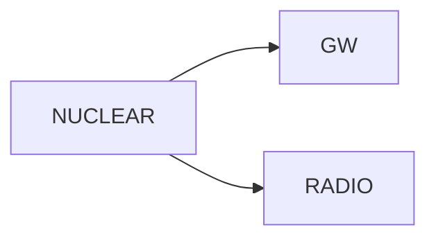

# Robust transition and holonomy review v0.1

## Question

Do the robust overlaps recovered by targeted optimization define explicit
multiobserver transitions, and is translation-cycle holonomy identifiable
from the resulting directed graph?

## Transition semantics

A transition points from the chart that produced the robust alternative
candidate to the chart that owns the target relation cell. This convention
distinguishes a translated local construction from the public cell whose
relation it reaches.

Two transitions meet every frozen requirement:

| Transition | Target cell | Paired worst-case loss | Stellar support |
|---|---:|---:|---|
| NUCLEAR → GW | 0 | 0.002904 | both EFT members pass |
| NUCLEAR → RADIO | 1 | 0.028244 | both EFT members pass |

Each record preserves its target medoid, member-specific relation losses,
candidate-parameter hash, EFT provenance, maximum masses, and stellar status.
Local parameter vectors are excluded.

## Directed graph and holonomy

The registered graph contains two outgoing NUCLEAR edges and no return edge:

There is no closed directed cycle of length two or greater. Consequently,
there is no composable sequence that returns to its starting chart.

The frozen inference is:

`HOLONOMY_NOT_IDENTIFIABLE`

The holonomy value is `null`. It is not zero. The two scalar relation losses
measure target-cell proximity and cannot substitute for the composition of
transition maps around a cycle.

## Interpretation

The atlas now has two evidenced directed transition records, but not a
transition groupoid or cycle-complete atlas. This is a positive structural
advance and a bounded non-identifiability result:

- cross-chart translation exists in two directions;
- reciprocal translation has not been demonstrated;
- path independence has not been tested;
- zero holonomy has not been observed or inferred;
- persistent observer plurality is retained.

## Decision

`ROBUST_TRANSITIONS_FROZEN_HOLONOMY_NOT_IDENTIFIABLE`

This closes the blocker requiring the existing robust transitions to be
formalized and the present graph to be classified. It opens the narrower
development requirement of recovering at least one reciprocal or otherwise
closed directed transition cycle before holonomy can be numerically tested.
Pilot and confirmatory entry remain forbidden.

